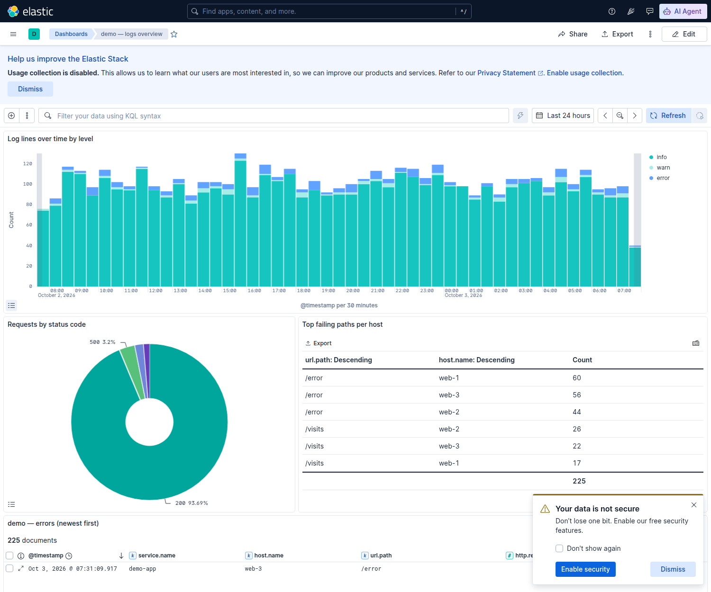

# ELK Module 04 — Kibana 🟡

## 🎯 Objectives
- Create **data views** and explore logs in **Discover**
- Search fast with **KQL** and filters; save searches
- Build visualizations (Lens and aggregation-based) and **dashboards**
- Keep data views, searches and dashboards **as code** (saved objects in Git) — export and import them by API
- Know Kibana's other tools: Dev Tools console, Grok Debugger, alerting rules

## 🧠 Why DevOps engineers care
During an incident, Kibana is where you go from "error rate is up" (a metric) to "it's `/visits` on web-3, only since
version 2.1.0, and it's Redis timeouts" (logs) in a couple of minutes. Being fast in Discover and KQL is a real on-call
skill — and treating dashboards as code keeps them alive across environments, just like Grafana (Phase 9).

---

## 📖 Lesson 4.1 — Start Kibana with data

```bash
cd ~/Practice/devops-bootcamp/10-elk/04-kibana/solutions
docker compose up -d                    # Elasticsearch + Kibana + a loader with 5000 log lines over 24 h
./kibana_setup.sh                       # data view + saved searches + visualizations + dashboard
```
http://localhost:5601 → **Dashboards → demo — logs overview**:



## 📖 Lesson 4.2 — Data views and Discover

A **data view** tells Kibana which indices to read (`demo-logs-*`) and which field is time (`@timestamp`).
**Discover** (☰ → Discover): pick the time range first, click a field in the sidebar to see top values, add fields as
columns, expand a document to see all of it, and **"view surrounding documents"** to see what happened just before an
error on the same host.

## 📖 Lesson 4.3 — KQL

```
log.level : error
http.response.status_code >= 500 and host.name : "web-3"
url.path : "/visits" and not http.response.status_code : 200
service.version : 2.1.0 and log.level : (error or warn)
message : *timeout*                       # wildcard on a text field
url.path : /wp-*                          # who scans for WordPress?
client.ip : 203.0.113.0/24                # IP fields understand CIDR
not log.level : info
```
Pin a filter (📌) to keep it while switching between Discover and dashboards. Save useful searches
(e.g. **demo — errors**) so the whole team has them.

## 📖 Lesson 4.4 — Visualizations and dashboards

| Visualization | Answers |
|---------------|---------|
| Bar chart over time, split by `log.level` | *When did errors start?* |
| Pie / donut of `http.response.status_code` | *What share of requests fail?* |
| Table: `url.path` × `host.name` with a `log.level : error` query | *Which path fails where?* |
| Saved search panel | *Show me the actual lines* |

**Lens** (drag and drop) is the default editor. Add panels to a dashboard, set the time range, save — and every panel
responds to the dashboard's query bar and time picker.

## 📖 Lesson 4.5 — Kibana as code

Everything in Kibana is a **saved object** (data views, searches, visualizations, dashboards) and can be exported as
NDJSON and imported by API — so dashboards live in Git, are reviewed, and are identical in every environment:
```bash
./kibana_setup.sh                       # POST /api/data_views/data_view + POST /api/saved_objects/_import
./export_dashboard.sh demo-logs-overview  # POST /api/saved_objects/_export → kibana/*.export.ndjson (stable, sortable)
```
Every Kibana write API needs the header `kbn-xsrf: true`. Workflow: change in the UI → export → review the diff →
commit → import in the next environment (a CI job, Phase 8).

## 📖 Lesson 4.6 — Other tools you'll use

- **Dev Tools → Console** — the Elasticsearch REST API with autocomplete (`GET demo-logs-*/_search`)
- **Dev Tools → Grok Debugger** — test patterns from Module 03 against sample lines
- **Stack Management → Rules** — alert when a query matches (e.g. more than 20 errors in 5 minutes); the free tier
  can write to an index or the server log, paid tiers add Slack/webhook connectors. (The capstone uses a small script
  instead, routed like Phase 9's alerts.)
- **ES|QL** — a piped query language in Discover: `FROM demo-logs-* | WHERE log.level == "error" | STATS count = COUNT(*) BY host.name`

---

## ⚠️ Common mistakes
- Wrong time range (the #1 reason for "no results")
- Searching `text` fields with exact matches or `keyword` fields with partial words — check the field type (`t` vs `k`)
- Dashboards only in one Kibana; no export in Git
- One data view for *everything* (`*`) — slow and confusing; one per log family
- Leaving Kibana open on a network without security (Module 05)

---

## 🧪 Labs
Solutions: [`solutions/`](solutions/) — `docker compose up -d`, then `./kibana_setup.sh`.

### Lab 1 ⭐ — Discover
Create the `demo-logs-*` data view in the UI. Answer with Discover only: how many errors in the last 24 h? Which host
has the most? What happened on that host in the 30 seconds before its latest error?

### Lab 2 ⭐⭐ — KQL
Write KQL for: 5xx on web-3; `/visits` failures; requests from one client IP range; WordPress scanners; warnings and
errors from version 2.1.0. Save two of them as searches.

### Lab 3 ⭐⭐ — A dashboard
Build the four panels from Lesson 4.4 with Lens and put them on a dashboard with the saved errors search. Click a bar
in the time chart — what happens to the other panels?

### Lab 4 ⭐⭐⭐ — Dashboards as code
Export your dashboard with `export_dashboard.sh`, delete it in the UI, and bring it back with `kibana_setup.sh`
(adapted to your file). Change a panel title in the UI, export again, and read the Git diff.

---

## ✅ Checkpoint
- [ ] I can create data views and investigate quickly in Discover
- [ ] I write KQL with fields, ranges, wildcards, CIDR and boolean logic
- [ ] I can build visualizations and dashboards that answer real on-call questions
- [ ] I keep Kibana saved objects in Git and move them with the export/import APIs

👉 Next: [Module 05 — Operating Elasticsearch](../05-operating-elasticsearch/README.md)
