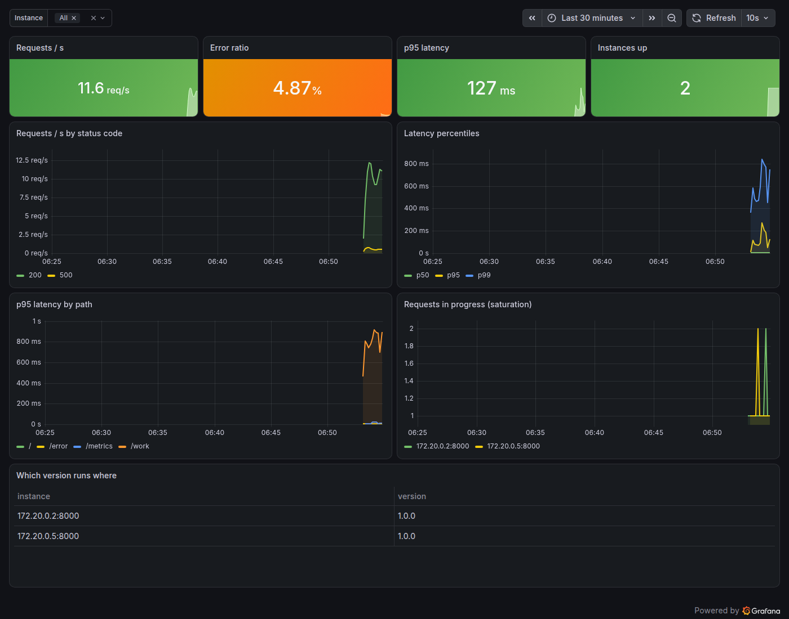

# Monitoring Module 05 — Grafana Dashboards as Code 🟡

## 🎯 Objectives
- Connect Grafana to Prometheus with a **provisioned** data source
- Build panels: time series, stat, table — with units, thresholds and legends
- Use **variables** (`$instance`) and `$__rate_interval`
- Store dashboards as **JSON in Git** and load them automatically
- Test dashboards: every panel query must return data

## 🧠 Why DevOps engineers care
Dashboards are what everyone looks at during an incident, a deploy or a capacity review. Dashboards made by clicking
drift, break silently when metrics are renamed, and disappear when someone deletes them. Dashboards as code are
reviewed, versioned and identical in every environment — the same idea as Terraform and Ansible, applied to graphs.

---

## 📖 Lesson 5.1 — Grafana in the stack

```bash
cd ~/Practice/devops-bootcamp/9-monitoring/05-grafana/solutions
docker compose up -d --build            # demo-app ×2 + load + node-exporter + Prometheus + Grafana
```
http://localhost:3000 → user `admin`, password `bootcamp` (lab only — set `GRAFANA_PASSWORD` in a `.env` file).
**Dashboards → Bootcamp → demo-app — RED**:



## 📖 Lesson 5.2 — Provisioning: data sources and dashboards from files

```
grafana/
├── provisioning/
│   ├── datasources/prometheus.yml     # Grafana creates the data source at start-up
│   └── dashboards/dashboards.yml      # "load every JSON file from /var/lib/grafana/dashboards"
└── dashboards/
    ├── demo-app-red.json              # the dashboards themselves, in Git
    └── node-use.json
```
```yaml
datasources:
  - name: Prometheus
    uid: prometheus               # stable id — dashboards refer to it
    type: prometheus
    url: http://prometheus:9090
    jsonData:
      timeInterval: 10s           # your scrape interval
```
```yaml
providers:
  - name: bootcamp
    folder: Bootcamp
    type: file
    allowUiUpdates: false         # can't save UI edits — change the JSON in Git
    options:
      path: /var/lib/grafana/dashboards
```

## 📖 Lesson 5.3 — Building panels

| Panel | Use for | Example |
|-------|---------|---------|
| **Stat** | one number now, coloured by thresholds | req/s, error %, p95 |
| **Time series** | trends | req/s by code, latency percentiles |
| **Table** | inventories | which version runs on which instance |
| Gauge, bar gauge, heatmap | utilisation, latency distribution | CPU %, histogram buckets |

Always set the **unit** (`reqps`, `s`, `percentunit`, `bytes`), a **legend** (`{{code}}`), and **thresholds** that
mean something (error ratio orange at 1%, red at 5%). Lay dashboards out top-down: the four headline numbers first,
details below — someone woken at 3 am should get the answer from the top row.

## 📖 Lesson 5.4 — Variables and intervals

```promql
sum(rate(http_requests_total{job="demo-app", instance=~"$instance"}[$__rate_interval]))
```
- **`$instance`** — a dropdown filled by `label_values(up{job="demo-app"}, instance)`; with "All" it becomes `.*`
- **`$__rate_interval`** — Grafana picks a safe range for `rate()` from the time range and scrape interval
  (never smaller than 4× scrape). Use it instead of hard-coded `[5m]` in dashboards.

## 📖 Lesson 5.5 — The workflow for changing a dashboard

1. Edit in the UI (on a dev Grafana, or with `allowUiUpdates: true` locally)
2. **Share → Export → Save to file** (or Dashboard settings → JSON Model)
3. Replace the file in `grafana/dashboards/`, review the diff in a pull request
4. Grafana reloads it within 30 s — in every environment

Then test it ([`check_dashboards.py`](solutions/check_dashboards.py)) — it asks Grafana whether the data source is
healthy and the dashboards are loaded, and runs every panel's query against Prometheus:
```
✅ data source: Successfully queried the Prometheus API.
✅ dashboard 'demo-app — RED' loaded in Grafana
   ✅ Requests / s [A] → 1 series
   ✅ Error ratio [A] → 1 series
   ...
PASS
```
Put that in CI and a renamed metric can never silently blank a dashboard again. (Bigger teams generate dashboards
with code — Grafonnet (Jsonnet), the Grafana Terraform provider, or Grafana's Foundation SDK.)

---

## ⚠️ Common mistakes
- Dashboards only in the UI — lost on rebuild, different in every environment
- No units → "0.0487" instead of "4.87%"
- `rate(x[1m])` hard-coded with a 30 s scrape interval → gaps; use `$__rate_interval`
- 40 panels nobody understands; no top row that answers "is it broken?"
- Data source referred to by **name** in some panels and by **uid** in others — breaks when renamed

---

## 🧪 Labs
Solutions: [`solutions/`](solutions/) — `docker compose up -d --build`, wait 1–2 minutes, `python3 check_dashboards.py`.

### Lab 1 ⭐ — Provisioned data source
Provision the Prometheus data source from a file with a fixed `uid`. Restart Grafana with a fresh volume
(`docker compose down -v && docker compose up -d`) — it's back with no clicking.

### Lab 2 ⭐⭐ — The RED dashboard
Build it in the UI first: 4 stat panels (req/s, error ratio, p95, instances up) with units and thresholds; time series
for req/s by code, p50/p95/p99, p95 by path, in-progress requests; a version table. Add the `$instance` variable.

### Lab 3 ⭐⭐ — Dashboards as code
Export your dashboard to `grafana/dashboards/`, provision it with `allowUiUpdates: false`, and confirm UI edits can't
be saved. Change a threshold in the JSON, commit, and watch Grafana pick it up.

### Lab 4 ⭐⭐⭐ — Test your dashboards
Write `check_dashboards.py`. Then rename a metric in one panel's JSON on purpose (e.g. `http_request_total`) and prove
the check fails. Add a USE dashboard for the host (CPU, memory, disk, load per CPU) and make it pass.

---

## ✅ Checkpoint
- [ ] I provision data sources and dashboards from files
- [ ] I build clear panels with units, legends, thresholds and a useful layout
- [ ] I use variables and `$__rate_interval`
- [ ] I keep dashboards in Git and test that every panel returns data

👉 Next: [Module 06 — Alerting & SLOs](../06-alerting-and-slos/README.md)
