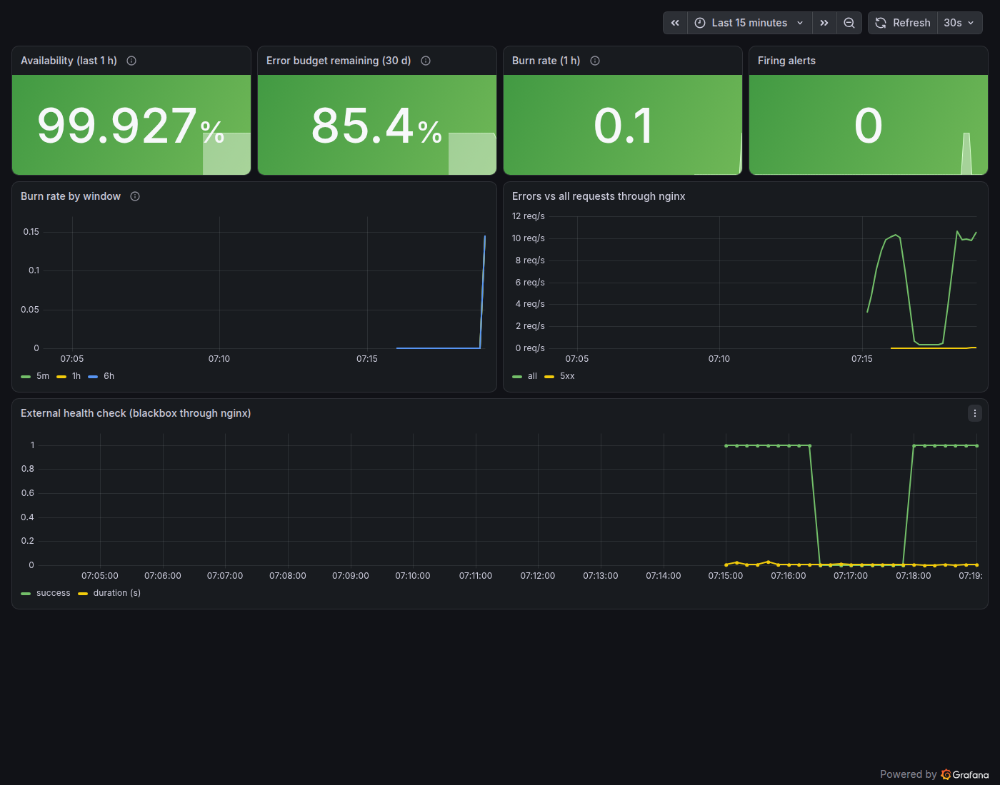

# Monitoring Module 08 — Monitoring Capstone 🏆

> **CEO note:** When something breaks at 3 am, I want the on-call engineer to get **one** clear page, open **one**
> dashboard, follow **one** runbook, and fix it. That's what you're building: an observability platform where every
> alert is tested, routed, actionable and linked to a runbook — and the whole thing is code.

**Definition of Done:**
- [ ] Every component is scraped: app instances, Redis, the host, Alertmanager, and an **external** probe through nginx
- [ ] Recording rules for RED; alerts for symptoms (down, errors, latency, site unreachable) with `for`, severity, runbook
- [ ] An SLO (99.5%) with error-budget and multi-window burn-rate alerts
- [ ] Every rule unit-tested with promtool; Alertmanager config and routing tested with amtool
- [ ] Alertmanager groups, routes (critical → pager + chat), inhibits and can be silenced
- [ ] Grafana provisioned from Git: RED, USE and SLO dashboards — and a test that every panel has data
- [ ] A runbook section for every alert, checked automatically
- [ ] An end-to-end test that breaks something and proves the page arrives — and resolves

---

## Project 1 ⭐⭐⭐ — The observable demo platform (full reference solution)

```
 users ──► nginx :8080 ──► demo-app ×3 ──► Redis
             ▲                 │ /metrics       │
   blackbox probe              ▼                ▼ redis-exporter      node-exporter (host)
             └──────────── Prometheus (recording · alerts · SLO rules) ──► Alertmanager ──► receiver (#pager, #chat)
                                   ▲
                            Grafana: RED · USE · SLO dashboards (provisioned)
```

```
platform/
├── compose.yaml               # 12 services
├── prometheus.yml             # scrape configs incl. DNS SD and the blackbox pattern
├── rules/recording.yml        # RED recording rules
├── rules/alerts.yml           # symptoms: down, missing, errors, latency, Redis, site unreachable/slow
├── rules/slo.yml              # SLO windows, error budget, fast/slow burn alerts
├── tests/*.yml                # promtool unit tests for all of the above
├── alertmanager.yml           # grouping, routes, inhibition
├── grafana/                   # provisioned data sources (Prometheus + Alertmanager) and 3 dashboards
├── runbooks/demo-app.md       # one section per alert
├── nginx.conf · blackbox.yml · loadgen.py · alert_receiver.py · check_dashboards.py
└── check.sh                   # static checks; --e2e breaks nginx and proves the page + resolution
```

👉 Reference: [`solutions/platform/`](solutions/platform/)

```bash
cd ~/Practice/devops-bootcamp/9-monitoring/08-capstone/solutions/platform
./check.sh                     # config, rules, unit tests, amtool, dashboards JSON, runbook coverage
./check.sh --e2e               # + full stack, all targets up, every panel has data, outage → page → resolved
```
Open http://localhost:3000 (admin / bootcamp) → **Bootcamp → demo-app — SLO 99.5% availability**:



The dip in *External health check* is the end-to-end test stopping nginx: the alert fired, paged, and resolved.

**Drills to run yourself:**
```bash
docker compose stop redis                                   # RedisDown → pager + chat; /visits 503
ERROR_FRACTION=0.3 docker compose up -d load                # DemoAppHighErrorRate + error budget fast burn
docker compose up -d --scale app=1                          # does latency change? which dashboard shows it?
docker compose stop app                                     # SiteUnreachable pages; after 5 min DemoAppMissing too.
                                                            # Why not DemoAppDown? (DNS SD drops stopped targets —
                                                            # there's no "up" series left to be 0)
docker compose logs -f receiver                             # what the on-call engineer would receive
```

**Stretch goals:** send notifications to a real Slack channel (`slack_configs` with the webhook in a secret file) ·
add nginx metrics with `nginx-prometheus-exporter` and `stub_status` · run `check.sh` in CI (Phase 8) on every change to
rules or dashboards · deploy the same rules and dashboards to Kubernetes with Module 07's objects.

---

## Project 2 ⭐⭐ — Monitor your own Linux servers
Use the Ansible practice fleet (Phase 7): write an Ansible role that installs node-exporter as a systemd service on
every node, and a Prometheus `file_sd` target file generated by Ansible from the inventory. Add alerts for disk filling
up (`predict_linear`), high load per CPU and a reboot (`changes(node_boot_time_seconds[1h]) > 0`).

## Project 3 ⭐⭐⭐ — Long-term storage and many clusters
Run two Prometheus servers (`env: staging` and `env: prod` external labels) that `remote_write` to one Grafana
Mimir or Thanos instance, and point Grafana at it. Query both environments in one panel with `sum by (env)`. Explain
what this buys you over federation.

## Project 4 ⭐⭐ — Tracing teaser
Add OpenTelemetry to a small Python service that calls demo-app, export traces to Jaeger (or Grafana Tempo), and
find a slow `/work` call end to end. Note what traces show that metrics and logs don't.

---

## 🎓 Monitoring phase complete!
Tick the [monitoring expert checklist](../README.md#-monitoring-expert-checklist). Metrics told you *that* something
is wrong; next you'll learn to find out *exactly what happened* — with logs.

👉 Next phase: [Phase 10 — Logging with ELK](../../10-elk/README.md)
